# 🛰️ Land Cover Classification using Google Cloud Platform

<p align="center">


</p>

A cloud-based land cover classification system that leverages **multispectral satellite imagery** and a custom **SpectralFormer** deep learning model to classify different land cover types. The application enables users to upload satellite images through a web interface, performs cloud-based inference using Google Cloud Platform, and generates land cover predictions with visual explanations.

---

# ✨ Features

🛰️ Classifies multispectral satellite images into land cover categories.

🧠 Uses the **SpectralFormer** deep learning architecture for spectral feature learning.

☁️ Cloud deployment using **Google App Engine**.

📦 Model storage using **Google Cloud Storage (GCS)**.

🌍 Interactive web interface for uploading satellite images.

🧩 Patch-wise image inference for efficient prediction.

🔍 Explainable AI using **Grad-CAM**, **LIME**, and **Layer-wise Relevance Propagation (LRP)**.

📊 Performance evaluation using multiple classification metrics.

---

# 🎥 Demo

Watch the complete workflow of the application, from uploading a multispectral satellite image to generating land cover predictions and Explainable AI visualizations.

<p align="center">
  <video src="assets/demo.mp4" controls width="900">
    Your browser does not support the video tag.
  </video>
</p>

▶️ **Project Demo:** [demo.mp4](assets/demo.mp4)

---

# 🏗️ Overall System Architecture

<p align="center">
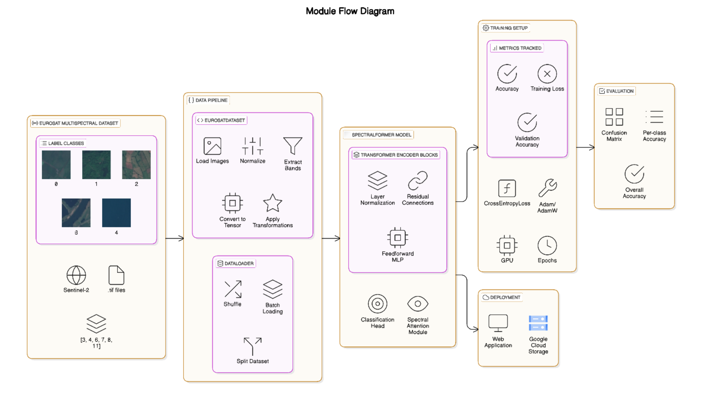
</p>

The complete workflow consists of image upload, preprocessing, cloud-based inference using SpectralFormer, prediction generation, and visualization of Explainable AI outputs.

---

# ☁️ Cloud Architecture

<p align="center">
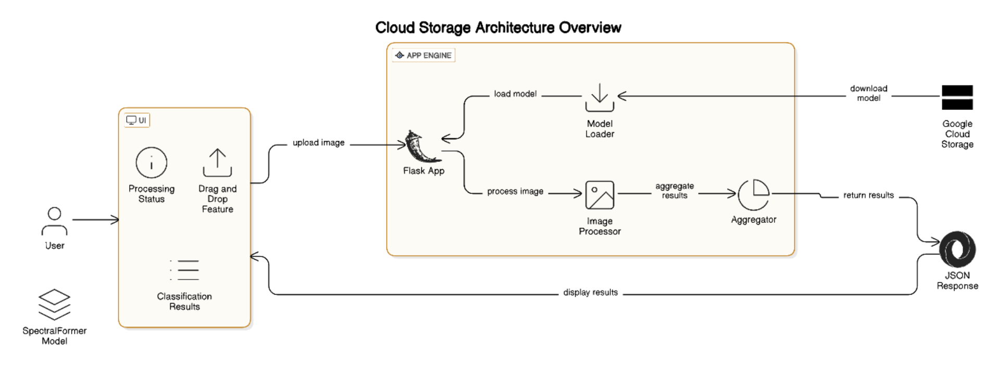
</p>

The application is deployed using **Google App Engine**, while the trained SpectralFormer model is stored in **Google Cloud Storage (GCS)**. Users interact with the Flask web application, which performs preprocessing, loads the model from cloud storage, and returns prediction results.

---

# 🧠 SpectralFormer Architecture

<p align="center">
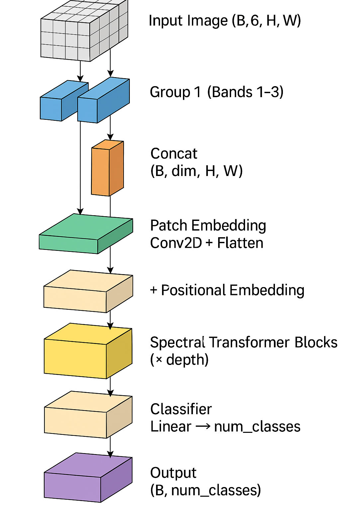
</p>

SpectralFormer is a Transformer-based architecture designed specifically for multispectral image classification. Instead of relying solely on spatial information, it learns rich spectral relationships across different image bands using Transformer encoders.

---

# 📂 Dataset

This project uses the **EuroSAT All Bands** dataset, a benchmark remote sensing dataset derived from **Sentinel-2** satellite imagery for land use and land cover classification.

### Dataset Highlights

🌍 27,000 labeled satellite image patches

🛰️ Acquired from Sentinel-2 multispectral imagery

📡 13 spectral bands (the model utilizes the first six bands)

📐 Image size: 64 × 64 pixels

🏷️ Originally contains 10 land cover classes

🎯 This project focuses on five classes:
- Forest
- Herbaceous Vegetation
- Pasture
- River
- SeaLake

### Official Dataset Repository

🔗 https://github.com/phelber/eurosat

---

# ⚙️ Technology Stack

| Category | Technologies |
|-----------|--------------|
| Programming | Python |
| Deep Learning | PyTorch |
| Model | SpectralFormer |
| Backend | Flask |
| Cloud Platform | Google Cloud Platform |
| Deployment | Google App Engine |
| Storage | Google Cloud Storage |
| Frontend | HTML, CSS, JavaScript |
| Explainable AI | Grad-CAM, LIME, LRP |

---

# 🚀 Getting Started

## Clone Repository

```bash
git clone https://github.com/Dreamfyre23/Landcover-Classification-Using-GCP.git

cd Landcover-Classification-Using-GCP
```

## Install Dependencies

```bash
pip install -r requirements.txt
```

## Run Application

```bash
python predict.py
```

The Flask application will be available locally.

---

# 🌐 Web Application

The web application provides an intuitive interface for performing land cover classification on multispectral satellite imagery. After uploading an image, the system processes it through the deployed SpectralFormer model and presents the predicted land cover class along with Explainable AI visualizations.

### Prediction Result - Example 1

<p align="center">
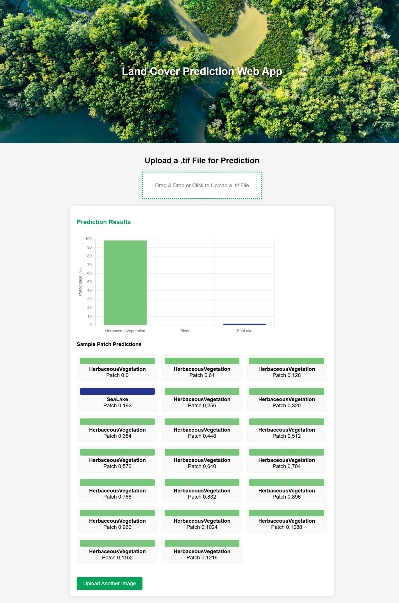
</p>

---

### Prediction Result - Example 2

<p align="center">
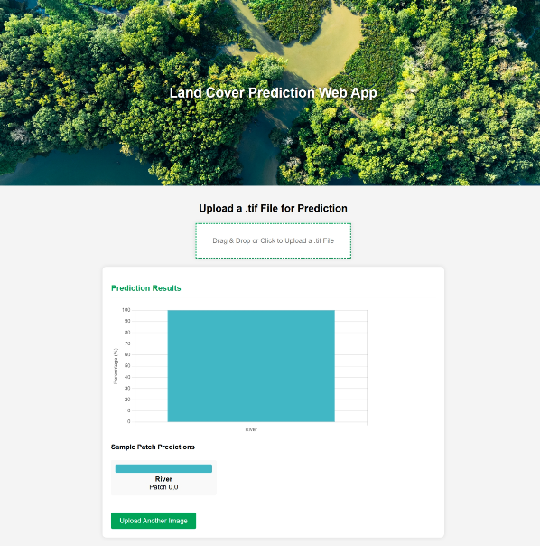
</p>

---

# 📊 Model Performance

## Performance Metrics

<p align="center">
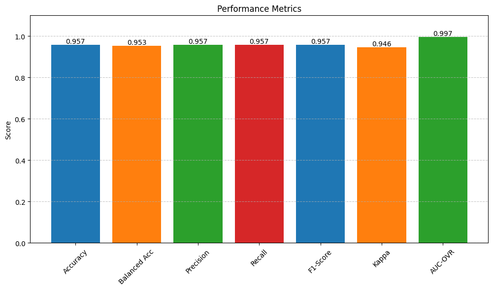
</p>

---

## Classification Report

<p align="center">
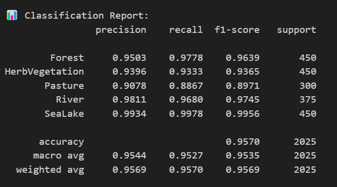
</p>

---

## Per-Class Metrics

<p align="center">
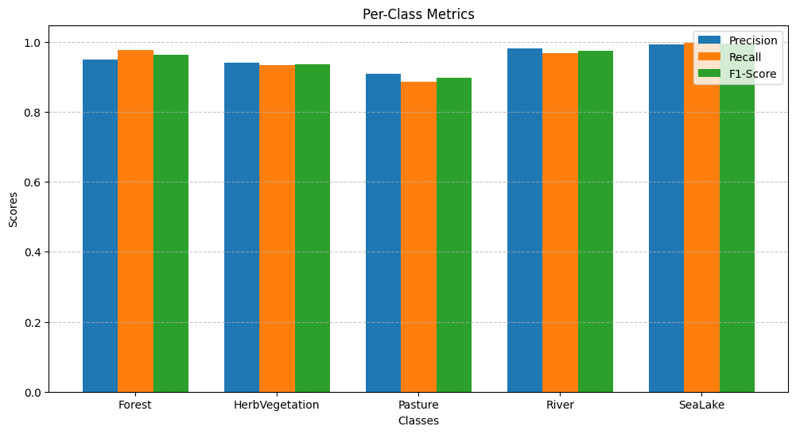
</p>

---

## Confusion Matrix

<p align="center">
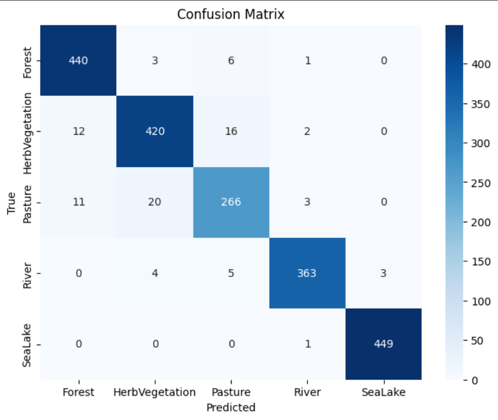
</p>

---

## ROC Curve

<p align="center">
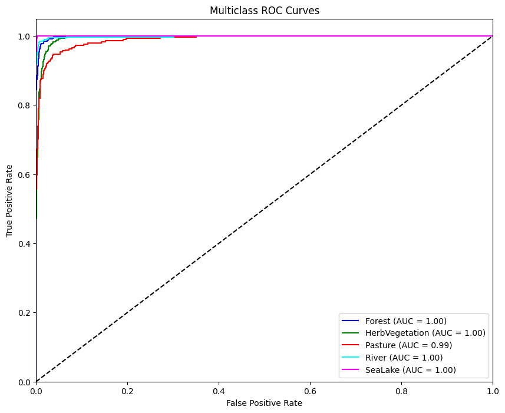
</p>

---

# 🧠 Explainable AI

To improve model interpretability, the project integrates multiple Explainable AI (XAI) techniques that visualize how the SpectralFormer model reaches its predictions. The following sample satellite image and its corresponding spectral bands are used to demonstrate the explanations generated by each method.

## Sample Satellite Image

<p align="center">
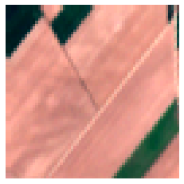
</p>

---

## Corresponding Spectral Bands

<p align="center">
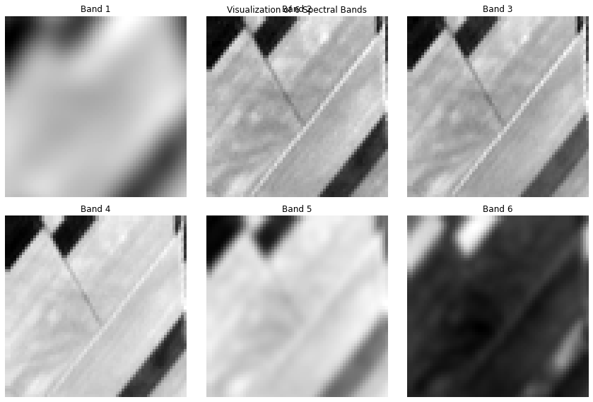
</p>

---

## Grad-CAM

<p align="center">
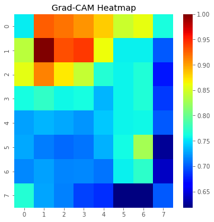
</p>

**Grad-CAM (Gradient-weighted Class Activation Mapping)** highlights the image regions that contribute most to the predicted land cover class, providing spatial insight into the model's decision-making process.

---

## LIME

<p align="center">
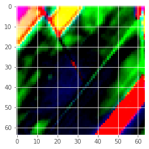
</p>

**LIME (Local Interpretable Model-agnostic Explanations)** explains individual predictions by approximating the model locally with an interpretable surrogate model, identifying the most influential image regions.

---

## Layer-wise Relevance Propagation (LRP)

<p align="center">
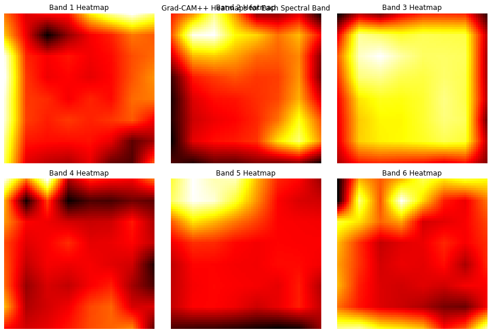
</p>

**Layer-wise Relevance Propagation (LRP)** redistributes the model's prediction score back through the network to visualize the contribution of each pixel toward the final classification.

---

# 🔮 Future Improvements

🚀 Support all EuroSAT land cover classes.

🛰️ Integrate additional Sentinel-2 spectral bands.

📱 Develop a mobile-friendly web interface.

⚡ Optimize inference latency for real-time applications.

🌍 Deploy as a scalable cloud service supporting concurrent users.

---

# 👨‍💻 Author

**Dinesh Ram S P**

M.Tech Artificial Intelligence

Amrita Vishwa Vidyapeetham

---

## ⭐ If you found this project useful, consider giving the repository a star!
